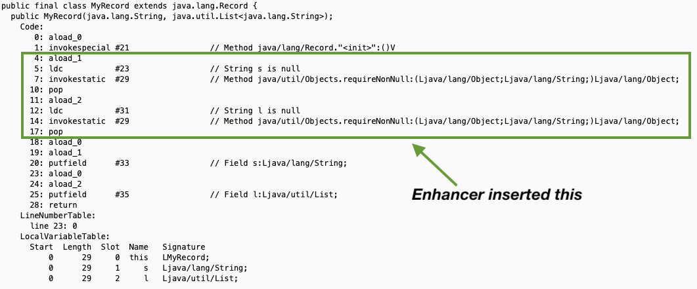

# RecordBuilder Enhancer

## What is RecordBuilder Enhancer

Inject verification, defensive copying, null checks or custom code into your Java Record constructors during compilation.

#### Features:

- [Builtin enhancers](#builtin-enhancers) to help with null checks and defensive copying
- [SPI](#write-your-own-custom-enhancer) for writing your own [custom enhancers](#write-your-own-custom-enhancer)
- [Create a custom annotation](#create-a-custom-annotation) that specifies a custom set of enhancers
 
#### Is it safe? Does it use undocumented features of Java?

- The Enhancer modifies your Java class files. There are some inherent safety concerns with this. However:
  - The industry standard [ASM](https://asm.ow2.io) library is used to do the modifications. ASM is even used in the JDK itself.
  - The Enhancer only inserts code in the default constructor of Java records. The code is inserted just after the
    call to `super()` and before any existing code in the constructor.
  - It's implemented as a standard [javac plugin](https://docs.oracle.com/en/java/javase/16/docs/api/jdk.compiler/com/sun/source/util/Plugin.html) and uses no undocumented features
- If you don't like the builtin enhancers you can [write your own](#write-your-own-custom-enhancer)

#### How does it relate to [RecordBuilder](../README.md)?

They aren't directly related but they share some code and both work on java records.

#### Why RecordBuilder Enhancer?

Java Records are fantastic data carriers and solve much of the pain of the lack of these types of classes
in older versions of Java. [RecordBuilder](../README.md) adds builders and withers to records. However,
records are still missing simple `null` checks and a few other niceties. This means boilerplate
for every record. RecordBuilder Enhancer is targeted at being able to write Java records without having to add
any additional code.

## How to Use RecordBuilder Enhancer

First, configure your build environment: see [details below](#javac-plugin). Then, use the Enhancer's
annotations to specify Java records that you want to be enhanced.

```java
@RecordBuilderEnhance(enhancers = RequireNonNull.class)
public record MyRecord(String s, List<String> l) {
}
```

Enhancer inserts code into the default constructor as if you wrote this:

```java
public record MyRecord(String s, List<String> l) {
    public MyRecord {
        Objects.requireNonNull(s, "s is null");
        Objects.requireNonNull(l, "l is null");
    }
}
```

The class file will be updated like this:



Enhancers are applied in the order listed in the annotation. E.g.

```java
// will apply RequireNonNull and then CopyCollection
@RecordBuilderEnhance(enhancers = {RequireNonNull.class, CopyCollection.class})
public record MyRecord(List<String> l) {}
```

_becomes_

```java
public record MyRecord(List<String> l) {
    Objects.requireNonNull(l);
    l = List.copyOf(l);
}
```

#### Arguments

Enhancers can optional receive arguments (the builtin [NotNullAnnotations](#notnullannotations) does). Use `@RecordBuilderEnhanceArguments`
to pass arguments. E.g.

```java
@RecordBuilderEnhance(enhancers = NotNullAnnotations.class, 
        arguments = @RecordBuilderEnhanceArguments(enhancer = NotNullAnnotations.class, arguments = "altnonnull"))
public record MyRecord(@AltNonNull List<String> l) {}
```


## Builtin Enhancers

| ID                                                                    | Arguments             | Description                                                                                                                                                                                                                                                   |
|-----------------------------------------------------------------------|-----------------------|---------------------------------------------------------------------------------------------------------------------------------------------------------------------------------------------------------------------------------------------------------------|
| [EmptyNullOptional](#emptynulloptional)                               | -                     | Use `empty()` for null Optional/OptionalInt/OptionalLong/OptionalDouble record components                                                                                                                                                                     |
| [EmptyNullString](#emptynullstring)                                   | -                     | Use `""` for null String record components                                                                                                                                                                                                                    |
| [CopyCollection](#copycollection)                                     | -                     | Make defensive copies of Collection, List and Map record components                                                                                                                                                                                           |
| [CopyCollectionNullableEmpty](#copycollectionnullableempty)           | -                     | Make defensive copies of Collection, List and Map record components or empty collections when `null`                                                                                                                                                          |
| [GuavaCopyCollection](#guavacopycollection)                           | -                     | Same as CopyCollection but uses Google Guava collections                                                                                                                                                                                                      |
| [GuavaCopyCollectionNullableEmpty](#guavacopycollectionnullableempty) | -                     | Same as CopyCollectionNullableEmpty but uses Google Guava collections                                                                                                                                                                                         |
| [RequireNonNull](#requirenonnull)                                     | -                     | Call `requireNonNull()` on all non-primitive record components - note: checks other enhancers and doesn't apply to Strings if EmptyNullString is being used, etc.                                                                                             |
| [NotNullAnnotations](#notnullannotations)                             | expression (optional) | Any parameter with an annotation whose name matches this enhancer's regular expression argument will be passed to `requireNonNull()`. The argument is optional. If not supplied then _(notnull)&#124;(nonnull)_ is used. Matching is always case insensitive. |

### Examples

#### EmptyNullOptional

```java
@RecordBuilderEnhance(enhancers = EmptyNullOptional.class)
public record MyRecord(Optional<String> s, OptionalInt i) {}
```

_becomes_

```java
public record MyRecord(Optional<String> s, OptionalInt i) {
    public MyRecord {
        s = (s != null) ? s : Optional.empty();
        i = (i != null) ? i : OptionalInt.empty();
    }
}
```

-------

#### EmptyNullString

```java
@RecordBuilderEnhance(enhancers = EmptyNullString.class)
public record MyRecord(String s) {}
```

_becomes_

```java
public record MyRecord(String s) {
    public MyRecord {
        s = (s != null) ? s : "";
    }
}
```

-------

#### CopyCollection

```java
@RecordBuilderEnhance(enhancers = CopyCollection.class)
public record MyRecord(Collection<String> c, Set<String> s, List<String> l, Map<String, String> m) {}
```

_becomes_

```java
public record MyRecord(String s) {
    public MyRecord {
        c = Set.copyOf(c);
        s = Set.copyOf(s);
        l = List.copyOf(l);
        m = Map.copyOf(m);
    }
}
```

-------

#### CopyCollectionNullableEmpty

```java
@RecordBuilderEnhance(enhancers = CopyCollectionNullableEmpty.class)
public record MyRecord(Collection<String> c, Set<String> s, List<String> l, Map<String, String> m) {}
```

_becomes_

```java
public record MyRecord(String s) {
    public MyRecord {
        c = (c != null) ? Set.copyOf(c) : Set.of();
        s = (s != null) ? Set.copyOf(s) : Set.of();
        l = (l != null) ? List.copyOf(l) : List.of();
        m = (m != null) ? Map.copyOf(m) : Map.of();
    }
}
```

-------

#### GuavaCopyCollection

```java
@RecordBuilderEnhance(enhancers = GuavaCopyCollection.class)
public record MyRecord(Collection<String> c, Set<String> s, List<String> l, Map<String, String> m) {}
```

_becomes_

```java
public record MyRecord(String s) {
    public MyRecord {
        c = ImmutableSet.copyOf(c);
        s = ImmutableSet.copyOf(s);
        l = ImmutableList.copyOf(l);
        m = Map.copyOf(m);
    }
}
```

-------

#### GuavaCopyCollectionNullableEmpty

```java
@RecordBuilderEnhance(enhancers = GuavaCopyCollectionNullableEmpty.class)
public record MyRecord(Collection<String> c, Set<String> s, List<String> l, Map<String, String> m) {}
```

_becomes_

```java
public record MyRecord(String s) {
    public MyRecord {
        c = (c != null) ? ImmutableSet.copyOf(c) : ImmutableSet.of();
        s = (s != null) ? ImmutableSet.copyOf(s) : ImmutableSet.of();
        l = (l != null) ? ImmutableList.copyOf(l) : ImmutableList.of();
        m = (m != null) ? ImmutableMap.copyOf(m) : ImmutableMap.of();
    }
}
```

-------

#### RequireNonNull

```java
@RecordBuilderEnhance(enhancers = RequireNonNull.class)
public record MyRecord(String s, Instant t) {}
```

_becomes_

```java
public record MyRecord(String s, Instant t) {
    public MyRecord {
        Objects.requireNonNull(s, "s is null");
        Objects.requireNonNull(t, "t is null");
    }
}
```

-------

#### NotNullAnnotations

```java
@RecordBuilderEnhance(enhancers = NotNullAnnotations.class,
        arguments = @RecordBuilderEnhanceArguments(enhancer = NotNullAnnotations.class, arguments = "(notnull)|(mynil)"))
public record MyRecord(String s, @NotNull Instant t, @MyNil Thing thing) {}
```

_becomes_

```java
public record MyRecord(String s, @NotNull Instant t, @MyNil Thing thing) {
    public MyRecord {
        Objects.requireNonNull(t, "t is null");
        Objects.requireNonNull(thing, "thing is null");
    }
}
```

## Create A Custom Annotation

Using `@RecordBuilderEnhance.Template` you can create your own RecordBuilderEnhance annotation that always uses the set of enhancers that you want. 

```java
@RecordBuilderEnhance.Template(enhancers = {RequireNonNull.class, NotNullAnnotations.class},
        arguments = @RecordBuilderEnhanceArguments(enhancer = NotNullAnnotations.class, arguments = "altnonnull.*"))
@Retention(RetentionPolicy.SOURCE)
@Target(ElementType.TYPE)
@Inherited
public @interface MyCoEnhance {
}
```

Now, you can use `@MyCoEnhance` instead of `@RecordBuilderEnhance` and the record will be enhanced with the enhancers specified.

## Javac Plugin

Add a dependency that contains the discoverable javac plugin to your build tool (see below for [Maven](#maven) or [Gradle](#gradle)). javac will
auto discover the Enhancer plugin. By default the enhancer assumes the standard directory layout used by
most Java build systems. i.e. if a Java source file is at `/foo/bar/myproject/src/main/java/my/package/MyClass.java`
the Enhancer will assume that the compiled class file for that source file will be found at
`/foo/bar/myproject/target/classes/my/package/MyClass.class`. If your build system does not use this method then
the Enhancer will need additional configuration ([see below](#options)). You can also 
configure some of the behavior of the Enhancer ([see below](#options)).

### Maven

```xml
<!-- only needed during compilation -->
<dependency>
    <groupId>io.soabase.record-builder</groupId>
    <artifactId>record-builder-enhancer</artifactId>
    <version>${record.builder.version}</version>
    <scope>provided</scope>
</dependency>

<!-- contains the annotations -->
<dependency>
    <groupId>io.soabase.record-builder</groupId>
    <artifactId>record-builder-enhancer-core</artifactId>
    <version>${record.builder.version}</version>
</dependency>
```

### Gradle

```groovy
dependencies {
  compileOnly 'io.soabase.record-builder:record-builder-enhancer:$version-goes-here'
  api 'io.soabase.record-builder:record-enhancer-core:$version-goes-here'
}
```

### Options

For normal usage you won't need to set any options for the Enhancer. The following options are available if you need them:

```text
[-hv] [--disable] [--dryRun] [--outputDirectory=<outputTo>] [DIRECTORY]

      [DIRECTORY]   The build's output directory - i.e. where javac writes generated classes. 
                    The value can be a full path or a relative path. If not provided the Enhancer 
                    plugin will attempt to use standard directories.
      --disable     Deactivate/disable the plugin
      --dryRun      Dry run only - doesn't modify any classes. You should enable verbose as well via: -v
  -h, --help        Outputs this help
      --outputDirectory=<outputTo>
                    Optional alternate output directory for enhanced class files
  -v, --verbose     Verbose output during compilation
```

javac plugin options are specifed on the javac command line or as part of your build tool. On the command line:

```shell
javac -Xplugin:"recordbuilderenhancer ...arguments..."
```

In Maven:

```xml
<plugin>
    <groupId>org.apache.maven.plugins</groupId>
    <artifactId>maven-compiler-plugin</artifactId>
    <configuration>
        <compilerArgument>-Xplugin:recordbuilderenhancer ...arguments...</compilerArgument>
    </configuration>
</plugin>
```

## Write Your Own Custom Enhancer

Notes on writing your own enhancer:

- Custom Enhancers must be built as separate modules from the code base you want to enhance. This is because
the enhancers must be available during compilation.
- You should somewhat be familiar with Java's AST classes though they are not hard to understand for newcomers
- Enhancers use the [ASM library](https://asm.ow2.io) to produce a list of statements to be inserted into Java record constructors
- You will need some knowledge of Java bytecode specifics and the Java Language specification. However, it's pretty simple
to use javac and javap to show you what bytecodes you need to specify ([see below](#how-to-get-the-bytecodes-for-your-enhancer))
- **IMPORTANT** - the ASM library has been shaded into the RecordBuilder Enhancer JAR. Make sure your custom enhancer uses the ASM classes
that are in the package `recordbuilder.org.objectweb.asm.*`. Many libraries use ASM and you may see the same classes in multiple packages.

For reference look at the implementation of the builtin enhancers to see exactly how to write one. [EmptyNullString](src/main/java/io/soabase/recordbuilder/enhancer/enhancers/EmptyNullString.java)
is a simple one to use as an example.

#### Add the SPI to your build

The RecordBuilder Enhancer SPI must be added to the module for your custom enhancer. It's artifact ID is `record-builder-enhancer-core`.
Your enhancer module can contain as many enhancers as you want. Each enhancer must implement the following interface:

```java
public interface RecordBuilderEnhancer {
    InsnList enhance(Processor processor, TypeElement element, List<String> arguments);
}
```

Your custom enhancer is called for Java records that are annotated to list your enhancer class.
Your enhancer is created once during the start of the build process and will be called multiple times for each Java record
that is annotated with your enhancer. Your enhancer must return a list of instructions to insert or an empty list.
The `element` parameter refers to the Java record being currently compiled. `arguments` are any arguments specified in the annotation
for the Java record. `Processor` holds utilities useful during enhancing. Look at the builtin enhancers to see details on how to write
them - [EmptyNullString](src/main/java/io/soabase/recordbuilder/enhancer/enhancers/EmptyNullString.java) is a good one to start with.

Build and install your enhancer JAR and you can then use your new custom enhancer as a dependency in other projects and it will be available as an enhancer.
Alternatively, if you have a multi-module build your enhancer can be a module and used to enhance the other modules in the
project. The [record-builder-test-custom-enhancer](../record-builder-test-custom-enhancer) does this.

#### How to get the bytecodes for your enhancer

The trick for getting the bytecodes for your enhancer is to write a simple Java source file that does what you want and then 
use the java tools to get the bytecodes. For example, let's say you want a custom enhancer that outputs the current date and time to standard 
out.

Create a text file called "Temp.java" ala:

```java
import java.time.Instant;

public class Temp {
  public Temp() {
    System.out.println(Instant.now());
  }
}
```

From a terminal compile the class:

```shell
javac Temp.java
```

Then dump the java bytecodes from the compiled class:

```shell
javap -c Temp.class
```

You will see:

```text
Compiled from "Temp.java"
public class Temp {
  public Temp();
    Code:
       0: aload_0
       1: invokespecial #1                  // Method java/lang/Object."<init>":()V
       4: getstatic     #7                  // Field java/lang/System.out:Ljava/io/PrintStream;
       7: invokestatic  #13                 // Method java/time/Instant.now:()Ljava/time/Instant;
      10: invokevirtual #19                 // Method java/io/PrintStream.println:(Ljava/lang/Object;)V
      13: return
}
```

The first two lines are the call to `super()`. The lines labeld `4`, `7`, and `10` are the bytecodes that you want for your enhancer.

Your enhance() implementation would look like this:

```java
InsnList insnList = new InsnList();
insnList.add(new FieldInsnNode(Opcodes.GETSTATIC, "java/lang/System", "out", "Ljava/io/PrintStream;"));
insnList.add(new MethodInsnNode(Opcodes.INVOKESTATIC, "java/time/Instant", "now", "()Ljava/time/Instant;"));
insnList.add(new MethodInsnNode(Opcodes.INVOKEVIRTUAL, "java/io/PrintStream", "println", "(Ljava/lang/Object;)V"));
return insnList;
```
